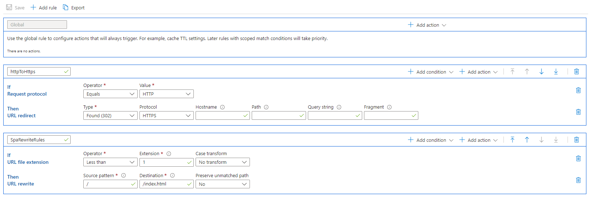

# Deployment

## GitHub Pages

Run `npm run deploy -- -m "{commitMessage}"`, this should push the latest build of the app to the remote `gh-pages` branch and deploy it to GitHub Pages.

## Azure Static Website (storage account)

Run `npm run build` locally, then deploy the `build` folder to the `$web` static website blob container. Ensure the Rules Engine configuration of the CDN endpoint is configured as shown, so that URLs with paths are rewritten correctly:

## Azure App Services

### Building the app

Run `npm run build` locally.

### Before deploying

Ensure `node_modules{,/**}` and `.vscode{,/**}` are listed under the `appService.zipIgnorePattern` array in `.vscode/settings.json`. This will ensure unnecessary files are not packed into the ZIP file, which will speed things up.

### Deploying

Run the deployment from VSCode.

### Configuring app settings

Set the following general settings:

- startup command - `npx serve -l 8080 build`
- enable HTTPS Only
